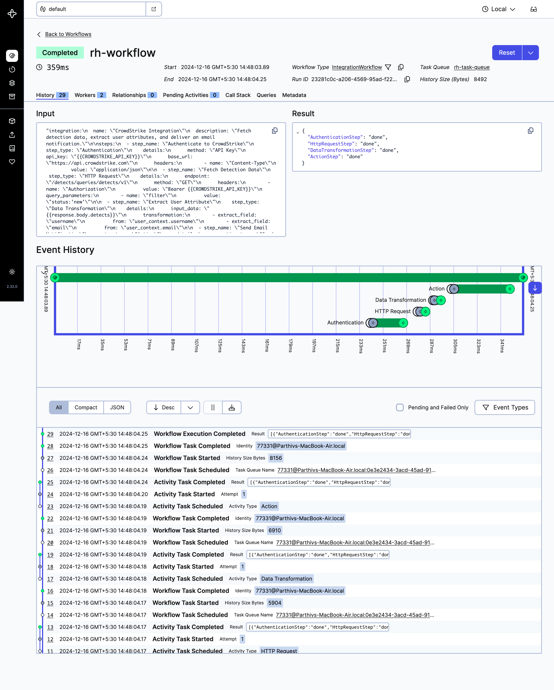

🌟 RH Integration Service
=========================

* * * * *

Overview
-----------

The **RH Integration Service** is a powerful Spring Boot application designed to process YAML-based configurations and execute **integration workflows** using Temporal.io.\
It streamlines processes like **authentication**, **data transformation**, **HTTP requests**, and **actions**, ensuring flexibility and scalability.

* * * * *

✨ Features
----------

-   **YAML Configuration Management**: Parses and processes workflows defined in YAML files.
-   **Modular Workflow Execution**: Uses Temporal workflows for seamless task orchestration.
-   **Extensible Step Definitions**: Supports dynamic steps (authentication, HTTP requests, actions).
-   **RESTful API**: Exposes endpoints to trigger and manage workflows.

* * * * *

🏗 High-Level Architecture
--------------------------


### Explanation of the Architecture

1.  **🧑‍💻 Client**

    -   Submits a request to execute a workflow via the **Application Server**.
2.  **🖥 Application Server**

    -   Handles `/runIntegration` endpoint requests.
    -   Submits the workflow definition (YAML) to the **Temporal Server**.
3.  **⚙️ Temporal Server**

    -   Orchestrates workflows, stores states, and schedules tasks into the **Task Queue**.
4.  **🗂 Task Queue**

    -   Stores pending workflow and activity tasks.
    -   **Workers** poll and pick up tasks for execution.
5.  **💼 Worker**

    -   Executes tasks such as:
        -   Parsing YAML.
        -   Creating steps using **Factory** and **Strategy patterns**.
        -   Executing each step as an activity on distributed workers.

* * * * *

🌐 Why Use Temporal.io?
-----------------------

> With a few modifications, the project could run without Temporal.io. However, Temporal brings significant advantages:

-   **Stateful Workflow Management**: Automatically persists workflow state.
-   **Retry Logic**: Handles automatic retries for failed activities.
-   **Durability**: Ensures workflows survive crashes and long downtimes.
-   **Scalability**: Executes thousands of workflows concurrently.
-   **Timeouts & Heartbeats**: Robust failure detection and handling.

Learn more at [Temporal.io](https://temporal.io/).

* * * * *

🔍 Low-Level Architecture
-------------------------


### 🛠 Design Principles

**Object-Oriented Programming Principles**:

1.  **Encapsulation**: Classes like `IntegrationWorkflow` and `Step` hide implementation details.
2.  **Abstraction**: Interfaces such as `Step` define contracts for steps.
3.  **Polymorphism**: Step classes (e.g., `AuthenticationStep`, `HttpRequestStep`) implement the `Step` interface.
4.  **Inheritance**: Shared attributes exist in `StepDetails` classes.

**Design Patterns**:

1.  **Factory Pattern**:

    -   Dynamically creates steps using `StepFactory`.
2.  **Strategy Pattern**:

    -   Varies behavior for authentication and actions.
    -   E.g., `APIKeyAuthentication`, `SendEmailAction`.
3.  **Template Method**:

    -   Defines a common step execution template.
    -   Here we have the `Step` interface where we one can define the execution flow for each step.

* * * * *

⚙️ Configuration and Installation
---------------------------------

### **Pre-requisites**

Ensure the following tools are installed:

-   **Java**: Version 17 or higher
-   **Maven**: Version 3.4 or higher
-   **Temporal Server**: Installed locally
    ```bash
    brew install temporal
    ```
-   **Git**: Version control system
-   **YAML Configuration**: Workflow definitions

* * * * *

### **Set Up Temporal Server**

Start the Temporal Server locally:

`temporal server start-dev`

Verify the server:

`http://localhost:8233/`

* * * * *

### **Clone the Repository**

```bash
git clone https://github.com/shahparthiv/rh.git
cd rh
```

* * * * *

### **Build the Project**


```bash
./mvnw clean package
```

* * * * *

### **Run the Application Server**

```bash
./mvnw spring-boot:run
```

**The application server will start on port 8080.**

* * * * *

### **Run the Temporal Worker**

The worker service runs separately to execute all activities:

```bash
./mvnw exec:java -Dexec.mainClass="com.temoral_worker.integration.executor.IntegrationExecutor"
```


* * * * *

### **Trigger the Workflow**

Use the following `curl` command to trigger the integration engine. It will pick the yml file from `resources/rh` directory and run the engine.

```
curl http://localhost:8080/runIntegrarion
```

* * * * *

Workflow Execution Logs
--------------------------

<pre>
14:48:04.157 [Activity Executor taskQueue="rh-task-queue", namespace="default": 1] INFO com.temoral_worker.integration.strategy.authentication.APIKeyAuthentication -- Authenticating to https://api.crowdstrike.com with API Key: {{CROWDSTRIKE_API_KEY}}
14:48:04.157 [Activity Executor taskQueue="rh-task-queue", namespace="default": 1] INFO com.temoral_worker.integration.step.AuthenticationStep -- Authentication step completed successfully.
14:48:04.176 [Activity Executor taskQueue="rh-task-queue", namespace="default": 1] INFO com.temoral_worker.integration.step.HttpRequestStep -- Performing HTTP Request:
14:48:04.176 [Activity Executor taskQueue="rh-task-queue", namespace="default": 1] INFO com.temoral_worker.integration.step.HttpRequestStep -- HTTP Request step completed successfully.
14:48:04.188 [Activity Executor taskQueue="rh-task-queue", namespace="default": 1] INFO com.temoral_worker.integration.step.DataTransformationStep -- Performing DataTransformationStep
14:48:04.188 [Activity Executor taskQueue="rh-task-queue", namespace="default": 1] INFO com.temoral_worker.integration.step.DataTransformationStep -- DataTransformationStep step completed successfully.
14:48:04.241 [Activity Executor taskQueue="rh-task-queue", namespace="default": 1] INFO com.temoral_worker.integration.step.ActionStep -- Executed Action: Send Email
14:48:04.241 [Activity Executor taskQueue="rh-task-queue", namespace="default": 1] INFO com.temoral_worker.integration.strategy.action.SendEmailAction -- Sending email via send email action to [{{email}}]: 
14:48:04.241 [Activity Executor taskQueue="rh-task-queue", namespace="default": 1] INFO com.temoral_worker.integration.step.ActionStep -- ActionStep completed successfully.

</pre>

* * * * *

## Temporal UI for the workflow
In the following screenshot once can see all the activity as a step and time taken by each activity.



Project Structure
--------------------


```
demo/
├── src/
│   ├── main/
│   │   ├── java/
│   │   │   ├── com/
│   │   │   │   ├── server         # Application package
│   │   │   │   │   ├── IntegrationEngine.java
│   │   │   │   │   ├── controller/
│   │   │   │   │   │   └── IntegrationController.java
│   │   │   │   ├── temoral_worker/integration/  # Core Temporal workflows
│   │   │   │   │   ├── core/
│   │   │   │   │   │   ├── IntegrationWorkflow.java
│   │   │   │   │   │   ├── IntegrationWorkflowImpl.java
│   │   │   │   │   │   └── IntegrationActivitiesImpl.java
│   │   │   │   │   ├── executor/ # This will start the worker
│   │   │   │   │   │   └── IntegrationExecutor.java
│   │   │   │   │   ├── step/
│   │   │   │   │   │   ├── Step.java
│   │   │   │   │   │   ├── AuthenticationStep.java
│   │   │   │   │   │   ├── HttpRequestStep.java
│   │   │   │   │   │   ├── DataTransformationStep.java
│   │   │   │   │   │   └── ActionStep.java
│   │   │   │   │   ├── pojo/      # Data Models
│   │   │   │   │   ├── factory/   # Factories for dynamic step creation
│   │   │   │   │   │   ├── AuthenticationFactory.java
│   │   │   │   │   │   ├── ActionFactory.java
│   │   │   │   │   │   └── StepFactory.java
│   │   │   │   │   ├── strategy/  # Strategy pattern implementations
│   │   │   │   │   │   ├── action/
│   │   │   │   │   │   │   ├── SendEmailAction.java
│   │   │   │   │   │   │   ├── SendSlackAction.java
│   │   │   │   │   │   │   └── ActionType.java
│   │   │   │   │   │   └── authentication/
│   │   │   │   │   │       ├── APIKeyAuthentication.java
│   │   │   │   │   │       ├── OAuthAuthentication.java
│   │   │   │   │   │       └── AuthenticationMethod.java
│   │   ├── resources/             # Application resources
│   │   │   ├── application.properties
│   │   │   └── rh/
│   │   │       └── cs.yml         # Workflow yml file
└── readme.md                      # Project documentation

```
* * * * *

🎯 Conclusion
-------------

The **RH Integration Service** leverages Temporal.io to manage workflows efficiently, combining design patterns and modular principles to ensure scalability, maintainability, and flexibility.
If we want to leverage server less architecture the same thing can be also achieved by AWS Step function.

* * * * *
