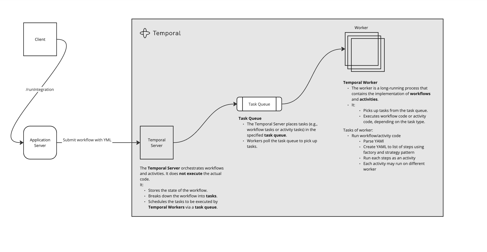
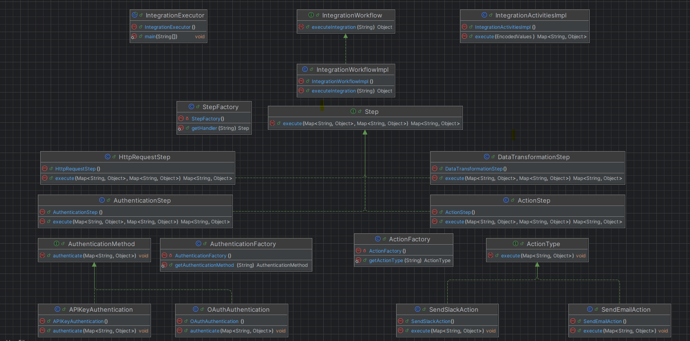

RH Integration Service
======================

Overview
--------

The **RH Integration Service** is a Spring Boot application designed to handle YAML-based configurations and execute a series of integration steps using Temporal workflows. It facilitates seamless integration processes by defining and executing steps such as authentication, data transformation, HTTP requests, and actions.

* * * * *

Features
--------

-   **YAML Configuration Management**: Parses and manages YAML files to define integration workflows.
-   **Modular Workflow Execution**: Utilizes Temporal workflows to execute a series of defined steps.
-   **Extensible Step Definitions**: Supports various steps including authentication, data transformation, HTTP requests, and custom actions.
-   **RESTful API**: Provides endpoints to interact with the service and manage workflows.

* * * * *

High Level Architecture
--------

Below is the high-level architecture of the system:

High Level Architecture


### Explanation of the Architecture

1. **Client**
   - Submits a request to execute a workflow through the application server.

2. **Application Server**
   - Handles the `/runIntegration` endpoint.
   - Submits the workflow definition (e.g., YAML) to the **Temporal Server**.

3. **Temporal Server**
   - Orchestrates workflows, manages states, and schedules tasks into the **Task Queue**.
   - **Note**: It does not execute the actual workflow code.

4. **Task Queue**
   - Temporarily stores tasks, such as workflow tasks or activity tasks.
   - Workers poll the task queue to pick up tasks.

5. **Worker**
   - Picks tasks from the queue and executes workflow/activity code.
   - The worker performs the following tasks:
   - Parsing YAML to extract workflow definitions.
   - Creating a list of steps using **Factory** and **Strategy** patterns.
   - Running each step as an activity.
   - Allowing each activity to run on different workers for scalability.

### Key Components

- **Temporal Server**:
  Responsible for orchestrating workflows and managing states but does not execute any actual business logic.

- **Task Queue**:
  Stores tasks (workflow tasks or activity tasks) that workers can pick up for execution.

- **Worker**:
  A long-running process that executes workflow and activity code.
  Workers are flexible and can run specific tasks across different machines or environments.

### Why Use Temporal.io?

We can also use the same code with few modification and can run without temporal.io but I have included it for following reason.
[Temporal.io](https://temporal.io/) is a scalable and reliable workflow orchestration platform. Here are the key benefits:


1.  **Stateful Workflow Management**: Retains the state of workflows, ensuring reliability even after crashes.
2.  **Retry Logic**: Automatically retries failed activities.
3.  **Durability**: Ensures long-running workflows persist their execution history.
4.  **Scalability**: Handles thousands of workflows concurrently.
5.  **Timeouts and Heartbeats**: Provides robust failure detection and handling.

* * * * *


Low Level Architecture
-------------------------------------



### Explanation of the Low Level Architecture

### OOP Principles

1.  **Encapsulation**: Classes like `IntegrationWorkflow` and `Step` hide their details behind clean APIs.
2.  **Abstraction**: Interfaces like `Step` and `IntegrationWorkflow` define contracts, hiding implementation specifics.
3.  **Polymorphism**: Step classes implement the `Step` interface, providing interchangeable behaviors.
4.  **Inheritance**: Common properties are shared among POJO classes, such as step details.

### Design Patterns

1.  **Factory Pattern**: Used in `StepFactory` to instantiate step implementations dynamically.
2.  **Strategy Pattern**: Handles variations in authentication (`APIKeyAuthentication`, `OAuthAuthentication`) and actions (`SendEmailAction`, `SendSlackAction`).
3.  **Template Method**: Used in steps where a common template defines execution flow.

* * * * *


## Configuration and Installation


### Pre-requisites


Ensure the following tools are installed:

- **Java**: Version 17 or higher
- **Maven**: Version 3.4 or higher
- **Temporal Server**: A running Temporal server instance.
    - Install Temporal server locally:
      ```bash
      brew install temporal
      ```

- **Git**: Version control system
- **YAML Configuration**: Required for defining workflows.

---


### Set Up Temporal Server

Ensure Temporal Server is running.

```bash
temporal server start-dev
```
You can varify using following URL:
```
http://localhost:8233/
```
---


### Clone the Repository


```bash
git clone https://github.com/shahparthiv/rh.git
cd rh
```
---

### Build the project


```bash
./mvnw clean package
```
---

### Run the application server

```bash
./mvnw spring-boot:run
```
The application server will start on 8080 port.

---


### Run the temporal worker
This will run the worker as a separate service and all the activities will be running here

```bash
 ./mvnw exec:java -Dexec.mainClass="com.temoral_worker.integration.executor.IntegrationExecutor"
```
---

### Trigger the workflow engine via following curl command

```bash
curl http://localhost:8080/runIntegrarion
```
---


### Workflow Execution Logs

<pre>
<span style="color: grey;">13:18:29.233 [Activity Executor taskQueue="rh-task-queue", namespace="default": 1] INFO</span> <span style="color: green;">com.temoral_worker.integration.strategy.authentication.APIKeyAuthentication</span> -- Authenticating to <span style="color: orange;">https://api.crowdstrike.com</span> with API Key: {{CROWDSTRIKE_API_KEY}}
<span style="color: grey;">13:18:29.233 [Activity Executor taskQueue="rh-task-queue", namespace="default": 1] INFO</span> <span style="color: green;">com.temoral_worker.integration.step.AuthenticationStep</span> -- Authentication step completed successfully.
<span style="color: grey;">13:18:29.252 [Activity Executor taskQueue="rh-task-queue", namespace="default": 1] INFO</span> <span style="color: green;">com.temoral_worker.integration.step.HttpRequestStep</span> -- Performing HTTP Request:
<span style="color: grey;">13:18:29.252 [Activity Executor taskQueue="rh-task-queue", namespace="default": 1] INFO</span> <span style="color: green;">com.temoral_worker.integration.step.HttpRequestStep</span> -- HTTP Request step completed successfully.
<span style="color: grey;">13:18:29.263 [Activity Executor taskQueue="rh-task-queue", namespace="default": 1] INFO</span> <span style="color: green;">com.temoral_worker.integration.step.DataTransformationStep</span> -- Performing DataTransformationStep
<span style="color: grey;">13:18:29.263 [Activity Executor taskQueue="rh-task-queue", namespace="default": 1] INFO</span> <span style="color: green;">com.temoral_worker.integration.step.DataTransformationStep</span> -- DataTransformationStep step completed successfully.
<span style="color: grey;">13:18:29.305 [Activity Executor taskQueue="rh-task-queue", namespace="default": 1] INFO</span> <span style="color: green;">com.temoral_worker.integration.step.ActionStep</span> -- Executed Action: <span style="color: orange;">Send Email</span>
<span style="color: grey;">13:18:29.305 [Activity Executor taskQueue="rh-task-queue", namespace="default": 1] INFO</span> <span style="color: green;">com.temoral_worker.integration.strategy.action.SendEmailAction</span> -- Sending email via send email action to <span style="color: orange;">[{{email}}]</span>:
<span style="color: grey;">13:18:29.305 [Activity Executor taskQueue="rh-task-queue", namespace="default": 1] INFO</span> <span style="color: green;">com.temoral_worker.integration.step.ActionStep</span> -- ActionStep completed successfully.
<span style="color: grey;">13:18:29.319 [workflow-method-rh-workflow-b8638d51-292d-4d8f-9e82-72792effcf40] INFO</span> <span style="color: green;">com.temoral_worker.integration.core.IntegrationWorkflowImpl</span> -- <span style="color: limegreen; font-weight: bold;">Integration Workflow Completed Successfully.</span>
</pre>


Project Structure
-----------------

```
demo/
├── .git/                          # Git configuration and objects
├── src/
│   ├── main/
│   │   ├── java/
│   │   │   ├── com/
│   │   │   │   ├── server         # Application package
│   │   │   │   │   ├── IntegrationEngine.java
│   │   │   │   │   ├── controller/
│   │   │   │   │   │   └── IntegrationController.java
│   │   │   │   ├── temoral_worker/integration/  # Core Temporal workflows
│   │   │   │   │   ├── core/
│   │   │   │   │   │   ├── IntegrationWorkflow.java
│   │   │   │   │   │   ├── IntegrationWorkflowImpl.java
│   │   │   │   │   │   └── IntegrationActivitiesImpl.java
│   │   │   │   │   ├── step/
│   │   │   │   │   │   ├── Step.java
│   │   │   │   │   │   ├── AuthenticationStep.java
│   │   │   │   │   │   ├── HttpRequestStep.java
│   │   │   │   │   │   ├── DataTransformationStep.java
│   │   │   │   │   │   └── ActionStep.java
│   │   │   │   │   ├── pojo/      # Data Models
│   │   │   │   │   ├── factory/   # Factories for dynamic step creation
│   │   │   │   │   │   ├── AuthenticationFactory.java
│   │   │   │   │   │   ├── ActionFactory.java
│   │   │   │   │   │   └── StepFactory.java
│   │   │   │   │   ├── strategy/  # Strategy pattern implementations
│   │   │   │   │   │   ├── action/
│   │   │   │   │   │   │   ├── SendEmailAction.java
│   │   │   │   │   │   │   ├── SendSlackAction.java
│   │   │   │   │   │   │   └── ActionType.java
│   │   │   │   │   │   └── authentication/
│   │   │   │   │   │       ├── APIKeyAuthentication.java
│   │   │   │   │   │       ├── OAuthAuthentication.java
│   │   │   │   │   │       └── AuthenticationMethod.java
│   │   ├── resources/             # Application resources
│   │   │   ├── application.properties
│   │   │   └── rh/
│   │   │       └── cs.yml         # Workflow yml file
└── readme.md                      # Project documentation

```
* * * * *
